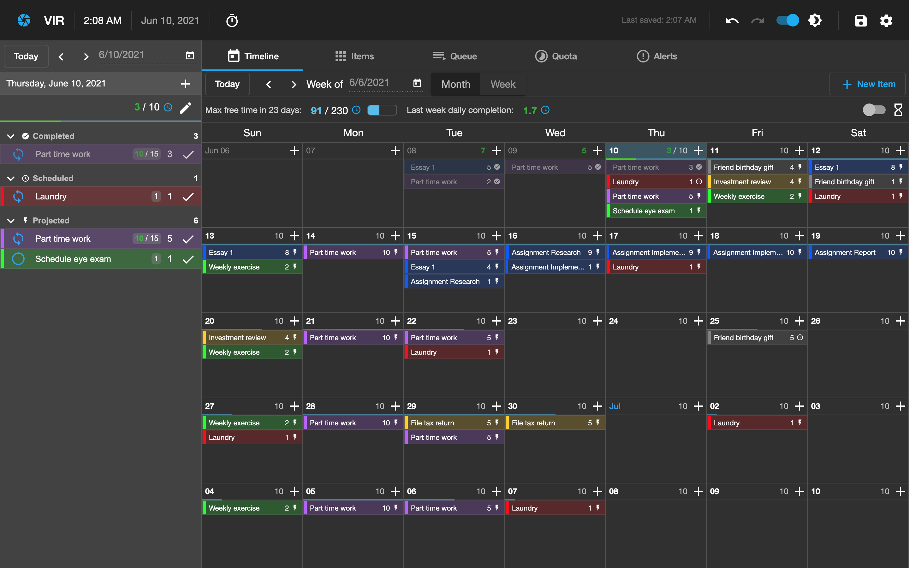
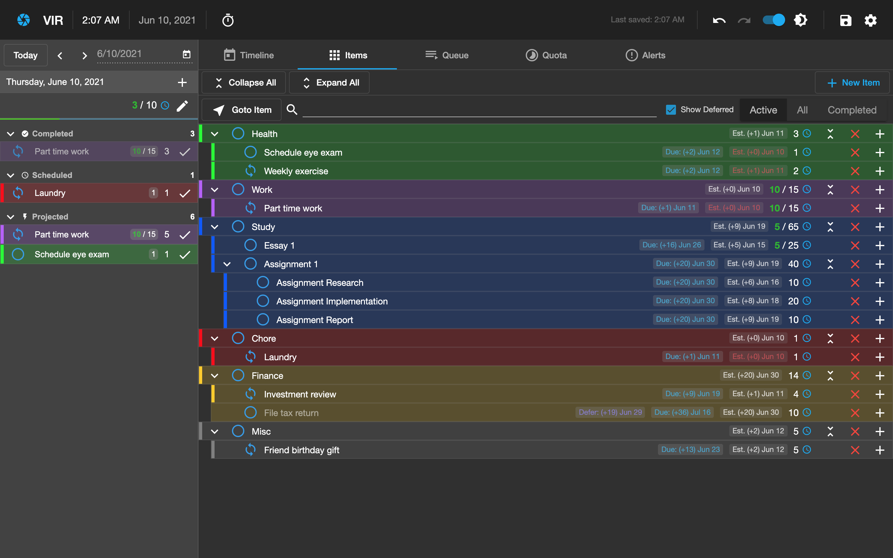

# VIR


**VIR** is an open-source intelligent time-management tool designed to tame the
stress. By simply listing your tasks and schedules, VIR can automatically
generate plans around your available time, and alert you of potential conflicts,
so you'll never have to worry about unrealistic deadlines or todo-list overload.

***





***

## Getting Started

VIR is built
with [angular-electron](https://github.com/maximegris/angular-electron).

### Building the Binary

1. Clone the repository:
   ```bash
   git clone https://github.com/TommyX12/VIR.git
   ```
2. Enter the directory and install dependencies:
   ```bash
   cd VIR
   npm install
   ```
3. Build the binary:
   ```bash
   npm run electron:build
   ```
   The built binary will be in `./release`.
   - **Mac**: Go to `./release`, and open the `.dmg` file.

### Development Build

To run live-reload debug build:

```bash
npm start
```

## Wiki

See the project [wiki](https://github.com/TommyX12/VIR/wiki). Check out
the [Basics](https://github.com/TommyX12/VIR/wiki/Basics) guide for an
introduction.
